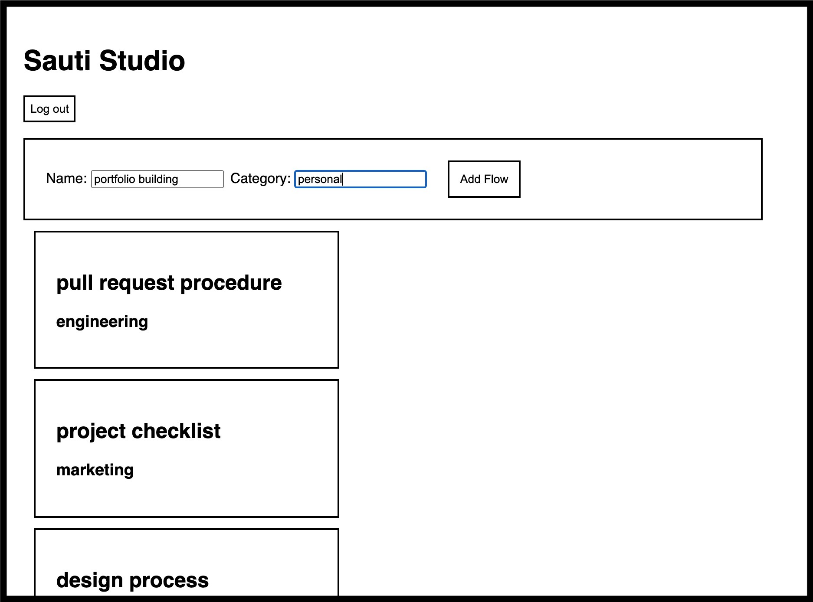

# Sauti Studio - Back End

## Table of Contents

- [About](#About)
- [Contributors](#Contributors)
- [Getting started](#Getting-started)
- [API Docmentation](#API-Documentation)

---

## About

Sauti Studio is an app that allows users to create categorized workflows with multiple pages in each flow. Visit the app <a href='https://sauti-forms.now.sh/' target='_blank' >here.</a>

The back-end API is written in `Node`, `Express`, and `Knex`. It uses a `SQLite3` database.

---

## Contributors

| [Dan Hauer](https://github.com/dlhauer) |
| :-------------------------------------: |

| 

---

## Getting started

**To run this server locally**

1. Clone this repo.
1. `cd` into **Back-End** directory.
1. Install dependencies: `npm i`.
1. Run server: `npm run server`.

---

## API Documentation

**BASE URL:** https://sauti-studio-3.herokuapp.com

- Attach endpoints to the Base URL to hit them with HTTP Requests.

**View documentation for all endpoints on [Postman.](https://documenter.getpostman.com/view/10278156/SWTG6auL?version=latest)**
